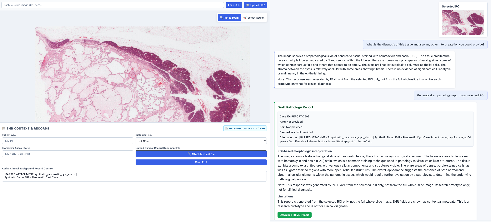

# Pathology Co-Pilot VLM

A local research prototype for interactive pathology image analysis using a browser-based region-of-interest (ROI) selection interface and a local PA-LLaVA pathology vision-language model backend.

The app allows a user to upload an H&E pathology image, select an ROI, ask visual pathology questions, receive PA-LLaVA-generated findings, optionally attach synthetic EHR/context text, and generate a downloadable draft pathology report.

> **Important:** This is a research and educational prototype only. It is not a medical device and must not be used for clinical diagnosis or patient-care decisions.

---

## Copilot overview

---

## Demo Goal

This project demonstrates a local pathology co-pilot workflow:

    Pathology image
        |
        v
    User selects ROI in browser
        |
        v
    Selected ROI crop is sent to PA-LLaVA
        |
        v
    User asks visual pathology questions
        |
        v
    Model returns ROI-based pathology description
        |
        v
    Optional report generation creates a downloadable HTML draft report

The system is designed around ROI-based visual analysis, not whole-slide diagnosis.

---

## Current Features

### Image and ROI workflow

- Upload local pathology images.
- View images with pan and zoom.
- Select a rectangular ROI.
- Show the selected ROI preview in the chat.
- Keep the selected ROI active for follow-up questions.
- Replace the active ROI when the user selects a new region.
- Clear the ROI when a new image is loaded.

### PA-LLaVA integration

- Sends the selected ROI image to a local PA-LLaVA service.
- Sends the user's visual question to PA-LLaVA.
- Uses local inference through a PA-LLaVA FastAPI wrapper.
- Avoids text-only Hugging Face fallback summaries that are not image-grounded.

### Chat behavior

- Send questions with button click or Enter.
- Ask follow-up questions about the same selected ROI.
- If no ROI is selected, the app asks the user to select one instead of falling back to a text-only model.

### EHR/context panel

- Allows optional upload of synthetic or demo EHR text.
- Treats EHR as contextual metadata.
- Keeps PA-LLaVA visual interpretation primarily image-based, to avoid clinical text biasing the visual description.

### Report generation

- Generates a draft report from the selected ROI.
- Displays the report in the right-side panel.
- Allows downloading the generated report as an HTML file.
- Includes limitations and a research-only disclaimer.

---

## System Architecture

The app runs as two local services.

    Browser UI
      |
      | POST /api/v1/analyze
      v
    Main FastAPI app
      src/main.py
      src/orchestrator.py
      src/pathology_vlm_client.py
      |
      | POST /predict
      | selected ROI image + user question
      v
    PA-LLaVA service
      services/palava_service/server.py
      |
      | calls xtuner zero_shot
      v
    PA-LLaVA / Pathology-LLaVA model

Main UI:

    http://127.0.0.1:8003

PA-LLaVA service:

    http://127.0.0.1:9001

---

## Repository Structure

    Pathology_Copilot_VLM/
    ├── src/
    │   ├── main.py
    │   ├── orchestrator.py
    │   ├── pathology_vlm_client.py
    │   └── templates/
    │       └── index.html
    ├── services/
    │   └── palava_service/
    │       └── server.py
    ├── demo_cases/
    │   └── synthetic_pancreatic_cyst_ehr.txt
    ├── docs/
    │   └── screenshots/
    │       └── ui-screenshot.png
    ├── requirements.txt
    ├── .env.example
    ├── .gitignore
    └── README.md

The PA-LLaVA source code and model weights are intentionally not committed to this repository. They should be installed separately under:

    external/PA-LLaVA-clean/

---

## What Is Not Included

This repository does not include:

- PA-LLaVA model weights.
- PLIP weights.
- Llama model weights.
- Converted PA-LLaVA checkpoints.
- Python virtual environments.
- Runtime service outputs.
- Large checkpoint files.

These files are excluded because they are large and may have separate licenses or access requirements.

Expected local PA-LLaVA model structure:

    external/PA-LLaVA-clean/
    ├── weights/
    │   ├── plip/
    │   ├── instruction_tuning_weight.pth
    │   ├── instruction_tuning_weight_ft/
    │   ├── domain_alignment_weight.pth
    │   └── domain_alignment_weight_ft/
    ├── pallava_instruction_tuning.py
    ├── pallava_domain_alignment.py
    └── xtuner_add/

For the current descriptive pathology workflow, the app uses:

    weights/domain_alignment_weight_ft

---

## Prerequisites

Recommended system:

- macOS or Linux.
- Python 3.10.
- Conda or Miniforge.
- Git.
- Local PA-LLaVA setup.
- Access to required model checkpoints.
- Enough memory to run the model locally.

The local setup uses two environments:

    1. .venv    -> main UI app
    2. pallava  -> PA-LLaVA / XTuner model service

Do not run both environments at the same time in one shell.

If both appear active, clean the shell with:

    deactivate 2>/dev/null || true
    conda deactivate 2>/dev/null || true
    conda deactivate 2>/dev/null || true

---

## Environment 1: Main UI App

From the project root:

    cd ~/Documents/pathology-copilot-vlm-mvp

    python -m venv .venv
    source .venv/bin/activate

    pip install --upgrade pip
    pip install -r requirements.txt

If requirements are incomplete, install the core packages manually:

    pip install fastapi uvicorn requests pydantic python-multipart jinja2

---

## Environment 2: PA-LLaVA Service

Activate the Conda environment used for PA-LLaVA:

    source /Users/YOUR_USERNAME/miniforge3/etc/profile.d/conda.sh
    conda activate pallava

The PA-LLaVA environment should include Python 3.10, PyTorch, torchvision, transformers, tokenizers, accelerate, peft, safetensors, xtuner, timm, einops, scipy, scikit-learn, opencv-python, pillow, fastapi, uvicorn, and python-multipart.

Exact package versions may depend on the PA-LLaVA and XTuner release.

---

## PA-LLaVA Model Setup

Place the PA-LLaVA repository under:

    external/PA-LLaVA-clean/

Expected location:

    ~/Documents/pathology-copilot-vlm-mvp/external/PA-LLaVA-clean

Place PA-LLaVA assets under:

    external/PA-LLaVA-clean/weights/

Expected files or folders:

    weights/plip/
    weights/instruction_tuning_weight.pth
    weights/domain_alignment_weight.pth

The converted domain-alignment checkpoint should be available at:

    weights/domain_alignment_weight_ft/

The service uses this path:

    export PALAVA_LLAVA_PATH="weights/domain_alignment_weight_ft"

---

## Configuration

Create a local `.env` file if desired:

    cp .env.example .env

Example `.env.example`:

    USE_PATHOLOGY_VLM=true
    PATHOLOGY_VLM_URL=http://127.0.0.1:9001/predict
    PATHOLOGY_VLM_TIMEOUT=1200

    PALAVA_ROOT=/Users/YOUR_USERNAME/Documents/pathology-copilot-vlm-mvp/external/PA-LLaVA-clean
    PALAVA_LLAVA_PATH=weights/domain_alignment_weight_ft

The app can also be configured directly through shell environment variables.

---

## Running the System

You need two terminals.

### Terminal 1: Start PA-LLaVA Service

    cd ~/Documents/pathology-copilot-vlm-mvp

    deactivate 2>/dev/null || true
    conda deactivate 2>/dev/null || true

    source /Users/YOUR_USERNAME/miniforge3/etc/profile.d/conda.sh
    conda activate pallava

    export PALAVA_ROOT="/Users/YOUR_USERNAME/Documents/pathology-copilot-vlm-mvp/external/PA-LLaVA-clean"
    export PALAVA_LLAVA_PATH="weights/domain_alignment_weight_ft"

    uvicorn services.palava_service.server:app --host 127.0.0.1 --port 9001

Check that the service is alive:

    curl http://127.0.0.1:9001/health

Expected response includes:

    "status": "ok"
    "llava_path": "weights/domain_alignment_weight_ft"

### Terminal 2: Start Main UI

    cd ~/Documents/pathology-copilot-vlm-mvp

    deactivate 2>/dev/null || true
    conda deactivate 2>/dev/null || true

    source .venv/bin/activate

    export USE_PATHOLOGY_VLM=true
    export PATHOLOGY_VLM_URL=http://127.0.0.1:9001/predict
    export PATHOLOGY_VLM_TIMEOUT=1200

    uvicorn src.main:app --host 127.0.0.1 --port 8003 --reload

Open in browser:

    http://127.0.0.1:8003

---

## Basic Reproduction Workflow

1. Start the PA-LLaVA service on port `9001`.
2. Start the main UI on port `8003`.
3. Open the browser UI.
4. Upload an H&E pathology image.
5. Click **Select Region**.
6. Draw an ROI over the image.
7. Confirm that the selected ROI preview appears in the chat.
8. Ask a question, for example:

       Describe this selected ROI for a pathologist. What are the main histopathological features and likely interpretation?

9. Ask a follow-up question without selecting a new ROI:

       What cell morphology and tissue architecture are visible in this selected region?

10. Click **Generate Report**.
11. Review the generated report in the right-side panel.
12. Click **Download HTML Report**.

---

## Example Questions

- Describe this selected ROI for a pathologist. What are the main histopathological features and likely interpretation?
- What is the main diagnosis suggested by this selected ROI?
- Are there any regions or cellular features that should be reviewed further?
- Describe the tissue architecture, cellular morphology, and stromal background in this ROI.
- Generate a concise draft pathology report for this selected ROI.

---

## Synthetic EHR Demo

A synthetic EHR file can be uploaded through the UI.

Example file:

    demo_cases/synthetic_pancreatic_cyst_ehr.txt

This file is synthetic and does not describe a real patient.

The EHR panel is intended for demonstration of contextual metadata. The model's pathology interpretation should remain primarily grounded in the selected ROI image.

---

## Report Generation Behavior

The **Generate Report** button sends a hidden report-generation request using the currently selected ROI.

The report is rendered as an HTML-style report card in the right-side panel and can be downloaded as:

    draft_pathology_report.html

The report includes:

- Case metadata.
- Optional EHR/context fields.
- ROI-based morphologic interpretation.
- Likely histopathological interpretation.
- Suggested ancillary review or studies if relevant.
- Limitations.
- Research-only disclaimer.

---

## Important Design Decisions

### 1. ROI-first inference

The system sends the selected ROI crop to PA-LLaVA instead of the whole slide.

Reasons:

- Whole-slide images are too large for direct VLM input.
- ROI selection makes the interaction more controllable.
- ROI-based analysis helps demonstrate targeted pathology questioning.

### 2. No text-only fallback

Earlier versions used a Hugging Face text-only fallback. This was removed for the PA-LLaVA workflow.

Reasons:

- Text-only fallback can generate fluent but non-image-grounded summaries.
- It can fail if Hugging Face credentials are missing.
- The MVP should focus on local ROI-based visual interpretation.

### 3. EHR does not override image findings

EHR context is useful for reports, but it can bias a vision-language model.

Current intended behavior:

    ROI image remains the primary evidence.
    EHR is contextual metadata only.

### 4. Report generation is still ROI-limited

The generated report is not a full pathology report from the whole slide.

It is a draft report based on:

    selected ROI + model response + optional metadata

---

## Troubleshooting

### UI opens but the model does not answer

Check that the PA-LLaVA service is running:

    curl http://127.0.0.1:9001/health

Check that the main app points to the PA-LLaVA service:

    echo $PATHOLOGY_VLM_URL

Expected:

    http://127.0.0.1:9001/predict

### Hugging Face 401 Unauthorized

This should not happen in the current ROI-based PA-LLaVA workflow.

If it appears, the old text-only fallback may still be active.

Check:

    grep -n "huggingface\|router.huggingface\|HF_TOKEN" src/orchestrator.py src/*.py

The PA-LLaVA-only flow should not depend on a Hugging Face router token.

### Follow-up question fails after the first answer

The selected ROI may have been cleared.

Expected behavior:

    Selected ROI remains active for follow-up questions.
    New ROI replaces old ROI.
    Loading a new image clears ROI.

Check frontend code for accidental clearing:

    grep -n "currentROI = null" src/templates/index.html

It should only reset when loading a new image, not after every answer.

### EHR biases the answer toward the wrong organ

Do not inject EHR directly into the PA-LLaVA visual prompt.

The intended behavior is:

    selected ROI image + user visual question only

EHR should be displayed as metadata or used carefully during report rendering.

### PA-LLaVA gives very short answers

Use the domain-alignment checkpoint for descriptive outputs:

    export PALAVA_LLAVA_PATH="weights/domain_alignment_weight_ft"

Use a question that asks for a descriptive pathology paragraph.

Example:

    Describe this selected ROI for a pathologist. Include tissue architecture, cell morphology, and likely interpretation.

### App is slow on Mac

This is expected if the model reloads for each request.

Possible future improvements:

- Keep the model loaded in memory.
- Serve PA-LLaVA from a GPU machine.
- Cache ROI responses.
- Use a lighter pathology VLM.
- Use a queue for long-running requests.

---

## Development Notes

Main UI file:

    src/templates/index.html

Backend route and orchestration:

    src/main.py
    src/orchestrator.py

Pathology VLM client:

    src/pathology_vlm_client.py

PA-LLaVA service wrapper:

    services/palava_service/server.py

---

## Git and Model Weight Policy

Do not commit:

- `.venv/`
- `external/`
- model checkpoints
- converted weights
- PLIP weights
- runtime logs
- service run folders
- `.env`

These are excluded by `.gitignore`.

Before committing, check:

    git status --short

Make sure no large model files appear.

---

## Safety Disclaimer

This software is for research and educational demonstration only. It is not a medical device. It does not provide a clinical diagnosis. It should not be used for patient-care decisions. All model outputs require review by qualified pathology professionals.

---

## Acknowledgements

This MVP integrates and builds on:

- PA-LLaVA / Pathology-LLaVA.
- XTuner.
- FastAPI.
- OpenSeadragon.
- Python scientific and ML tooling.

Users must follow the licenses and access terms of the original codebases and model checkpoints.
